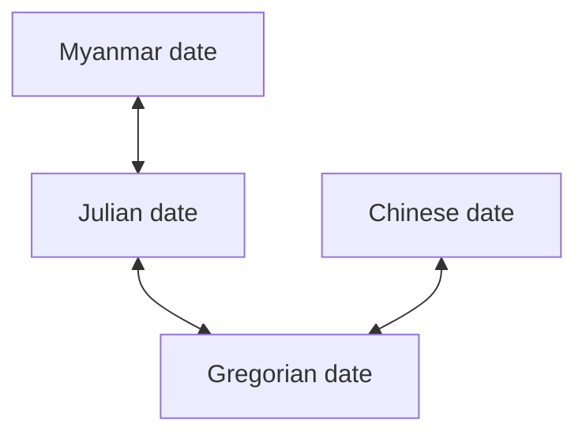

#### Algorithm reference
Myanmar date calendar calculation
https://coolemerald.blogspot.com/2013/06/algorithm-program-and-calculation-of.html

Myanmar date calendar calculation
https://coolemerald.blogspot.com/2013/12/blog-post.html


## Date conversion
This is actual flow of how this package convert myanmar date to Gregorian date. 

We do not have direct conversion from Myanmar date to Gregorian date. 
To convert from Myanmar date to Gregorian date, we have to convert to Julian date first. Then, convert it to Gregorian date.

In Same way, converting from Gregorian date to Myanamr date also need to convert Gregorian date to Julian date first. Then, convert it to Myanmar date.





## Example
```javascript

import { MyanmarDate, MyanmarMonths, MyanmarMonthType, MoonPhase } from 'mm-calendar';
const date = MyanmarDate({ day: 17, month: 10, year: 2024 }, { lang: 'mm' }) // Gregorian date

const date1 = MyanmarDate.fromMyanmarDate({
    year: 1386,
    month: MyanmarMonths.Tagu,
    day: 29,
    moonPhase: MoonPhase.waxing,
    myanmarMonthType: MyanmarMonthType.hnaung,
    fortnightDay: 14,
}, { lang: 'mm' })
const currentDate = MyanmarDate.now()
```


### Date conversion
Convert date to different format

```javascript
date.toGregorian()      // to gregorian date
date.toMoment()         // to momentjs date object
date.toMyanmarDate()    // to myanmar date
date.toDate()           // to javascript date object
date.toJulian()         // to julian date number
```


### Myanmar Astro
Calculation of astro is based on https://coolemerald.blogspot.com/2013/06/algorithm-program-and-calculation-of.html


```javascript

console.log(date.astro)

// OUTPUT: 
// {
//   sabbath: true,
//   sabbatheve: false,
//   yatyaza: false,
//   pyathada: true,
//   thamanyo: false,
//   amyeittasote: false,
//   warameittugyi: false,
//   warameittunge: false,
//   yatpote: false,
//   thamaphyu: false,
//   nagapor: false,
//   yatyotema: false,
//   mahayatkyan: false,
//   shanyat: false,
//   nagahle: 'west',
//   mahabote: 'Adipati',
//   nakhat: 'orc'
// }
```

### Buddhist year
သာဿနာနှစ်
```javascript
date.getBuddhistYear() 
```


### Holidays
We can check the date is holiday or not. We put default public holiday and chinese holiday from မြန်မာ ၃ဘာသာ calendar.

##### International holiday 

| Name    | Date |
| --------- | ------- |
|1st January|New year|
|14th Feb|Valentine day|
|8th Mar|Woman day|
|1th April|April fool day|
|1st May|May day|
|11th May|Mother day|
|15th Jun|Father day|
|24th Dec|Christmas|


##### Myanmar holiday 

| Name    | Date |
| --------- | ------- |
|14th Jan|လွတ်လပ်ရေးနေ့|
|12th Feb|ပြည်ထောင်စုနေ့|
|19th Feb|အာဇာနည်နေ့|
|19th Mar|တောင်သူလယ်သမားနေ့|
|27th Mar|တော်လှန်ရေးနေ့|
|19th July|တော်လှန်ရေးနေ့|
|11th Nov|အမျိုးသားနေ့|
|တန်ခူးလ ၁ရက်|သင်္ကြန်|
|တန်ခူးလ|သင်္ကြန် အကြို|
|တန်ခူးလ|သင်္ကြန် အကျ|
|တန်ခူးလ|သင်္ကြန် အတတ်|
|တန်ခူးလ|သင်္ကြန် နှစ်ဆန်း ၁ရက်|
|တပေါင်းလပြည့်ရက်|တပေါင်းလပြည့်နေ့|
|သီတင်းကျွတ်လပြည့်ရက်|သီတင်းကျွတ်ပိတ်ရက်(၃)ရက်|
|ဓမ္စကြာရက်လပြည့်နေ|ဓမ္စကြာပိတ်ရက်|
|ကဆုန် လပြည့်နေ|ကဆုန်ညောင်ရေသွန်းပွဲ|
|တန်းဆောင်မုန်း လပြည့်နေ|တန်းဆောင်မုန်း လပြည့်နေပိတ်ရက်|
|ပြာသိုလ ၁ရက်နေ့|ကရင်နှစ်သစ်ကူး|


##### Chinese holiday 

| Name    | Date |
| --------- | ------- |
|1st Oct|国庆节|
|24th Oct|平安夜 (Christmas eve)|
|正月 初一|除夕|
|正月 初六|清水祖师|
|正月 初九|天宫宝生|
|正月 十五|元宵节|
|正月 十八|岱枝兴福|
|二月 初二|福德正神诞辰|
|二月 十九|观音宝诞|
|三月 初七|清明节|
|三月 廿三|马祖宝生|
|五月 初五|端午节|
|六月 廿九|观音得道|
|七月 初七|七夕（chinese valentine day）|
|七月 十五|中元节|
|八月 初七|孔子诞辰|
|九月 初九|重阳节（တရုတ်ရှင်ဥပဂုတ္တပူဇော်ပွဲ）|
|九月 廿九|观音出家|
|十一月 初二|冬至|


#### You can check if date is holiday or not


```javascript

// Lunar based holiday is not fixed date in Gregorian Calendar
// it depend on Lunar cycle and moon phase 
console.log(date.isLunarBasedHoliday())

// Fixed date holiday mean
// for example, every year of Feb 14 is a valientine day
console.log(date.isFixedDateHoliday()) 

// combine both Lunar base holiday and fixed date holiday
console.log(date.isHoliday()) 

// Lunar based holiday full moon day
console.log(date.isFullmoonDay()) 
```


#### Get holidays in year of ...
static method that find all the holidays in a year is return array of <code>RecursiveEventDate</code> object. We put default public holiday and chinese holiday from မြန်မာ ၃ဘာသာ calendar
``` javascript
console.log(MyanmarDate.getHolidaysOfYear(2023))

// OUTPUT:
//  [
//   RecursiveEventDate {
//     day: 1,
//     month: 1,
//     culture: 'international',
//     type: 'fixed',
//     key: 'new-year'
//   },
//   RecursiveEventDate {
//     day: 11,
//     month: 1,
//     culture: 'burmese',
//     type: 'lunar',
//     key: 'karen-new-year'
//   },
//   RecursiveEventDate {
//     day: 14,
//     month: 1,
//     culture: 'international',
//     type: 'fixed',
//     key: 'independent-day'
//   },
//   ...
//  ]

```


#### Hide default holiday
You can hide default holiday by calling this functon everywhere;
``` javascript
HolidaysConfig.hideDefaultHoliday()
```

#### You can also set custom holiday !
if you don't want to use default holiday, you can manage custom holiday.
``` javascript
// don't forgot to hide default holiday
HolidaysConfig.hideDefaultHoliday(); 

// for fixed or gregorean date event 
// every year of first day of january is a new year
HolidaysConfig.add({ 
    day: 1, 
    month: 1, 
    culture: 'international', 
    type: 'fixed', 
    key: 'new-year', // => remember this key
    translation: {
        mm: 'နေ့နာနှစ်',
        en: 'New Year',
        cn: '新年'
    }
})


// You can also add lunar based event
// NOTE: it only support chinese and burmese lunar based unit and indian lunar based unit not supported yet

// FOR MYANMAR LUNAR BASED EVENT
// Myanmar lunar based unit require 
// "month" as MyanmarMonths
// "monthType" 
// "moonPhase" properties
// တန်ခူးလဆန်း ၁၁ ရက်နေ့ 
HolidaysConfig.add({
    day: 11,
    month: MyanmarMonths.Tagu,
    culture: 'burmese', // => change it into burmese
    type: 'lunar', // => change it into lunar instead of fixed
    monthType: MyanmarMonthType.oo, // required
    moonPhase: MoonPhase.waxing, // required
    key: 'karen-new-year', // => remember this key
    translation: {
        mm: 'ကရင်နှစ်သစ်ကူး',
        en: 'Karen New Year',
        cn: '卡恩新年'
    }
})


// FOR CHINESE LUNAR BASED EVENT
// 正月 廿三号
HolidaysConfig.add({
    day: 23, // 廿三
    month: 1, // 正月
    culture: 'chinese', // => change it into 'chinese'
    type: 'lunar', // => change it into lunar instead of fixed
    key: 'xin-nian', // => remember this key
    translation: {
        mm: 'တရုတ်ရိုးရာနှစ်သစ်ကူး',
        en: 'Chinese New Year',
        cn: '新年'
    }
})
```


#### Clear and delete custom holiday
``` javascript
HolidaysConfig.clearCustomHoliday()

// You can delete custom created holiday by using key
HolidaysConfig.deleteCustomHoliday('karen-new-year')
```


<!-- 
#### format()
You can format date. 
But unfortunately, currently we support only myanmar format
```javascript
date.format("S s Y f d s f a")
// OUTPUT: သာသနာနှစ် ၁၃၈၆ တဆောင်မုန်းလပြည့် ကျော် ၁ရက်နေ့ 
``` -->


### MyanmarDate object is immutable !!!
MyanmarDate object is immutable. Therefore we give API to modify and create new MyanmarDate object
``` javascript
const newDate = date.clone();
const date2 = date.copyWidth({ day: 1, month: 10 })
```


#### Language
Update language
```javascript
date.setLang('mm')
```


#### Algorithm reference
Myanmar date calendar calculation
https://coolemerald.blogspot.com/2013/06/algorithm-program-and-calculation-of.html

Myanmar date calendar calculation
https://coolemerald.blogspot.com/2013/12/blog-post.html